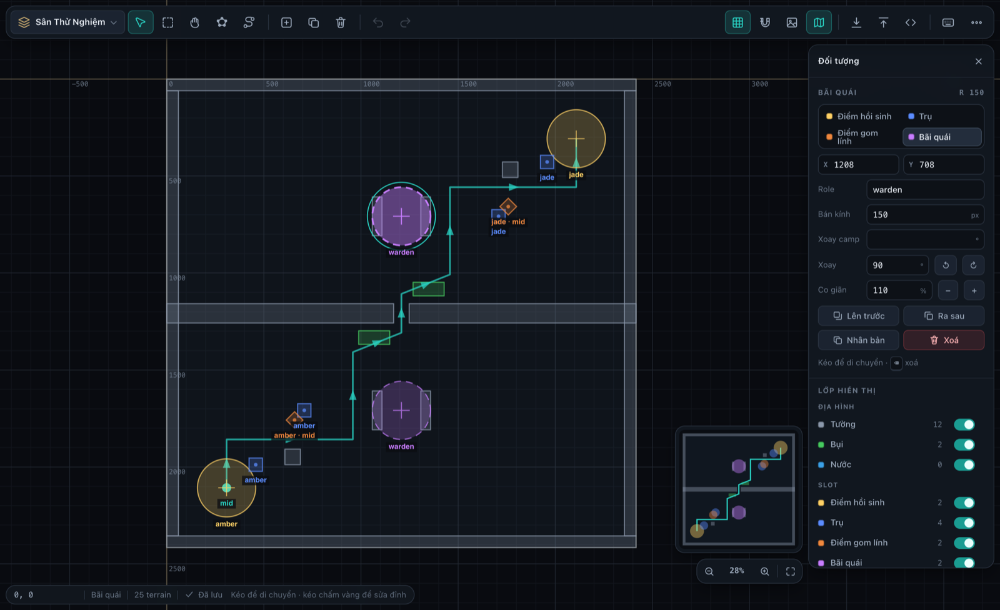

> **Code của editor nằm ở `public/map-editor/`**, không phải ở đây.
>
> Nó là một trang tĩnh: HTML + JS thuần, không qua bundler, nên nó sống trong
> `public/` để Vite chép nguyên xi và phục vụ ở `<game>/map-editor/`. Thư mục này
> chỉ giữ tài liệu và ảnh chụp màn hình — thứ không có lý do gì để tải về máy
> người chơi.
>
> Mở bằng `npm run dev` rồi vào `/map-editor/`, hoặc bấm **Tạo map** ở menu chính.

# LOL2D-MapEditor2

Công cụ vẽ bản đồ cho **moba2d** (và vẫn export được cho LOL2D đời trước).

Mô hình dữ liệu bám đúng `MapGeometry` trong
`moba2d-core/src/content/ContentPack.ts`: địa hình, slot và lane.

**Chạy hoàn toàn local, không cần mạng, không cần build.** Mọi chỉnh sửa tự
lưu vào localStorage của trình duyệt; nút **Lưu file / Mở file** đọc-ghi
`.json` trên máy. File export từ các bản cũ (kể cả bản Firebase ngày xưa)
vẫn mở được bình thường.



## Chạy

```bash
# Ảnh nền bị chặn khi mở bằng file:// — chạy qua một static server bất kỳ:
python3 -m http.server 8123
# rồi mở http://localhost:8123/
```

## Thao tác

### Chuột

| | |
|---|---|
| Cuộn con lăn | Zoom **ngay tại vị trí con trỏ** |
| Kéo trên nền trống | Quét chọn nhiều polygon một lúc |
| Giữ `Space` / chuột giữa / chuột phải + kéo | Di chuyển khung nhìn |
| Kéo trong lòng polygon | Di chuyển polygon (chọn nhiều thì cả nhóm đi cùng) |
| Kéo chấm vàng | Sửa từng đỉnh |
| Nháy đúp lên hình | Vào **chế độ sửa đỉnh** (`E`) — xem dưới |
| Nháy đúp lên cạnh | Chèn đỉnh mới đúng vào cạnh đó |
| `Shift` + nháy | Thêm / bớt khỏi vùng chọn |

### Chế độ sửa đỉnh (`E`, hoặc nháy đúp lên hình)

Chọn nhiều đỉnh một lúc để dời hoặc xoá hàng loạt. Đây là một **mode tường
minh** chứ không phải đổi ngầm hành vi của cú kéo: ngoài mode, kéo trên nền
vẫn quét chọn nhiều polygon như cũ; trong mode, cùng cú kéo đó quét chọn
nhiều **đỉnh** của hình đang sửa. Cách Illustrator (Direct Selection) và
Figma (double-click vào vector) đều làm vậy — nếu để một cử chỉ tự đổi
nghĩa theo trạng thái vô hình thì không ai đoán nổi nó sắp làm gì.

Vào bằng nút công cụ (dùng được trên cảm ứng), nháy đúp, hoặc `E`/`Enter`.
Trong mode:

- kéo trên nền → quét chọn đỉnh; `Shift`+nháy → thêm/bớt từng đỉnh
- kéo một đỉnh đã chọn → dời **cả cụm**
- `⌫` xoá mọi đỉnh đang chọn (chặn lại nếu còn dưới 3 đỉnh, lane dưới 2)
- mũi tên dịch đỉnh (không dịch cả hình), `Ctrl+A` chọn hết đỉnh
- `Esc` thoát dần: bỏ chọn đỉnh → rời mode → bỏ chọn hình

Các hình khác mờ đi trong lúc sửa, đỉnh đang chọn tô xanh viền trắng, còn
thanh trạng thái ghi rõ đang chọn mấy đỉnh — để lúc nào cũng biết mình đang
ở mode nào.

### Touchpad

Hai ngón cuộn ngang-dọc để di chuyển, chụm để zoom. Độ nhạy zoom của
touchpad và của con lăn chuột được tính riêng (touchpad bắn ra bước rất nhỏ
nên cần hệ số lớn hơn nhiều). Nếu vẫn không hợp tay, menu **…** có
*Con lăn chuột* (tự nhận / luôn zoom / luôn cuộn) và *Tốc độ zoom*
(chậm / vừa / nhanh).

### Điện thoại & máy tính bảng

Một ngón kéo trên nền trống để di chuyển, hai ngón chụm để zoom, chạm để
chọn, kéo để di chuyển polygon. Vùng chạm vào đỉnh được nới rộng gấp đôi so
với chuột. Thanh công cụ tự rút gọn, bảng thuộc tính trượt lên từ đáy, và
menu **…** luôn chứa đủ mọi lệnh.

### Phím tắt

`V` chọn · `M` quét chọn vùng · `H` kéo khung nhìn · `P` vẽ polygon tự do ·
`L` vẽ lane · `N` thêm tường · `A` thêm đỉnh tại con trỏ · `D` xoá đỉnh ·
`Shift+H` / `Shift+V` lật ngang / dọc · `Shift+C` căn tâm ·
`F` vừa màn hình · `G` lưới · `Shift+G` hút lưới · `Tab` bảng thuộc tính ·
`Del` xoá · mũi tên dịch 1px (`Shift` = 10px) · `Ctrl+Z` / `Ctrl+Shift+Z`
hoàn tác · `Ctrl+A` chọn tất cả · `Ctrl+D` nhân bản · `Ctrl+S` lưu file ·
`Ctrl+C`/`Ctrl+X`/`Ctrl+V` copy/cắt/dán (`Ctrl+Shift+V` dán tại chỗ) ·
`Ctrl+M` danh sách map · `Ctrl+I` nhập JSON · `Ctrl+E` export moba2d ·
`?` xem đầy đủ.

## Mô hình đối tượng

Tám loại, chia đúng ba nhóm của `MapGeometry`:

| nhóm | loại | hình | thuộc tính riêng |
|---|---|---|---|
| `terrain` | Tường / Bụi / Nước | polygon | — |
| `slots.spawn` | Điểm hồi sinh | vòng tròn | `faction`, `r` |
| `slots.structure` | Trụ | điểm | `faction`, `kind: 'turret'` |
| `slots.minion` | Điểm gom lính | điểm | `faction`, `lane`, `scatter?` |
| `slots.neutral` | Bãi quái | vòng tròn | `role`, `r`, `rotationDeg?` |
| `lanes` | Lane | đường gấp khúc hai chiều | `id` (còn `from`/`to` là dẫn xuất) |

Cấp map có thêm `id` (slug) và danh sách **phe** — đúng `MapSummary`. Đổi
tên một phe thì mọi `faction`/`from`/`to` đang trỏ vào nó đi theo luôn.

`MapSummary.size` chỉ có một số nên map moba2d là hình vuông; editor vẫn cho
vẽ map chữ nhật nhưng sẽ cảnh báo và có nút *Làm vuông*.

Map cũ mở lên được quy đổi tự động: `brush` → `bush`, `turret1`/`turret2` →
`structure` với `faction` là phe thứ nhất / thứ hai.

### Vì sao địa hình luôn được cắt lồi

`TerrainField` và `Vision` của core chỉ cho kết quả đúng với polygon lồi —
*"every wall deeper than it is wide is authored as several convex boxes
butted together"*. Nên bạn cứ vẽ polygon lõm cho thoải mái; editor giữ hình
gốc để sửa, và chỉ xuất ra các mảnh lồi đã cắt sẵn.

## Kiểm tra

Bảng thuộc tính có mục **Kiểm tra** chạy nền, soi đúng những gì schema đòi:
phe không tồn tại, `lane` mà điểm gom lính trỏ tới không có thật, lane trùng
id, bãi quái thiếu `role`, map không vuông, phe chưa có điểm hồi sinh, vật
thể nằm ngoài khung map… Kết quả cũng hiện ngay trên đầu hộp Export — chỗ
cuối cùng còn kịp sửa.

## Chức năng

- **Nhiều map** — mỗi map là một bản nháp riêng có ảnh thu nhỏ trong menu
  *Danh sách map*: tạo mới (đặt tên + kích thước, map chữ nhật OK), đổi tên,
  nhân bản, xoá. Mở app là vào thẳng map đang làm dở, **đúng chỗ đang xem**:
  vị trí và mức zoom được nhớ riêng cho từng map, F5 hay đóng tab mở lại đều
  quay về nguyên chỗ cũ.
- **Đổi kích thước map + scale nội dung** — sửa W/H trong bảng thuộc tính
  rồi editor hỏi luôn *"kéo nội dung theo khung mới?"*, hoặc dùng nút
  **Đổi kích thước & scale nội dung…**. Ví dụ 12500×12500 thấy to quá thì
  thu về 6400×6400, mọi polygon / slot / lane co theo đúng tỉ lệ ×0.512, kể
  cả bán kính spawn, bán kính bãi quái và `scatter` của điểm gom lính.
  Camera cũng co theo nên nhìn vào y như trước khi đổi.

  Scale quanh **gốc (0,0)** chứ không quanh tâm map — toạ độ map chạy từ 0
  tới `size` nên nhân quanh gốc mới ánh xạ đúng 0…12500 sang 0…6400, không
  lệch mép nào. Thu nhỏ quá đà thì làm tròn có thể ép polygon mỏng thành
  bẹt; editor đếm và báo lại để còn kịp `Ctrl+Z`.

  Menu `…` còn có **Scale nội dung theo %** cho trường hợp vẽ lỡ tay quá to
  mà không muốn động vào khung.
- **Copy / cắt / dán** (`Ctrl+C` / `Ctrl+X` / `Ctrl+V`) — dán vào **vị trí
  con trỏ**; `Ctrl+Shift+V` dán **tại chỗ**, giữ nguyên toạ độ gốc (tiện khi
  chuyển đồ giữa hai map). Dán được sang tab editor khác, và phe của nguồn
  được mang theo nên slot không bị mồ côi. Dán một JSON lạ (MapGeometry,
  bản export) thì nó gộp thẳng vào map đang mở.

  Dùng đúng sự kiện `copy`/`cut`/`paste` của trình duyệt chứ không tự bắt
  phím: sự kiện thật mang sẵn dữ liệu nên không phải xin quyền clipboard, và
  copy chữ trong ô nhập vẫn hoạt động như thường.
- **Hoàn tác không giới hạn** (80 bước) cho mọi thao tác, kể cả xoá hết map.
- **Chọn nhiều** bằng cách kéo một vùng, rồi di chuyển / xoay / lật / co giãn
  / đổi loại / xoá cả nhóm cùng lúc. Vùng quét phải **chạm vào đường viền**
  của hình (một đỉnh nằm trong vùng, hoặc một cạnh cắt qua vùng) — cố ý
  *không* tính trường hợp vùng quét nằm lọt trong ruột hình. Nhờ vậy quét
  mấy hình nhỏ nằm trong phần lõm của một polygon lớn sẽ không vơ luôn hình
  lớn; lọc bằng hộp bao không thôi thì lần nào cũng dính, vì hộp bao của
  hình lõm trùm cả chỗ lõm. Điểm đánh dấu (trụ, spawn, bãi quái) tính theo
  vị trí tâm của nó.
- **Căn tâm** (`Shift+C`) — dời **gốc** của hình về trung bình các đỉnh, mà
  hình vẫn đứng yên tại chỗ. Gốc là thứ vô hình cho tới khi nó lệch: nó là
  tâm xoay khi xoay một hình đơn lẻ, là cặp X/Y trong bảng thuộc tính, và là
  chấm xanh giữa hình. Kéo đỉnh vài lượt là gốc trôi ra rìa, xoay một cái
  thấy hình văng đi. Nút hiện sẵn độ lệch hiện tại (`lệch 1167, 1075` /
  `đã căn`) nên biết ngay có cần bấm hay không.

  Dùng **trung bình cộng các đỉnh**, không phải trọng tâm theo diện tích —
  đúng nghĩa "vị trí trung bình của mọi dot". Khác biệt chỉ lộ ra khi một
  cạnh bị chia thành nhiều đỉnh: điểm này sẽ bị kéo về phía cạnh đó.
- **Lật ngang / lật dọc** (`Shift+H` / `Shift+V`, hoặc nút trên toolbar và
  trong bảng thuộc tính). Trục lật luôn là tâm hộp bao của vùng chọn: một
  polygon thì lật tại chỗ, chọn nhiều thì cả cụm đảo bên đồng thời mỗi cái
  tự lật — giống Figma. Dùng được cho cả lane.
- **Lane là đường HAI CHIỀU.** `getLaneWaypoints()` trong `src/game/lanes.ts`
  tự trả bản `.reverse()` cho phe thứ hai, nên **một** `LaneDefinition` phục
  vụ cả hai phe — đó là lý do Proving Grounds chỉ khai một lane `mid` mà hai
  phe đều đi được. Editor vẽ đúng như vậy: mũi tên **hai đầu**, và hai mút
  đường tô theo màu của phe xuất phát ở đầu đó.

  Vì thế bảng thuộc tính **không có ô "từ phe / tới phe"**. Engine không đọc
  hai field ấy (`setActiveLanes` chỉ lấy `id` + `waypoints`); chỗ duy nhất
  đọc là `referenceMap.test.ts`, và nó đọc như một **cặp hai đầu** chứ không
  phải chiều đi. Giá trị của chúng lại bị ràng buộc hoàn toàn bởi quy ước
  waypoint 0 — cho gõ tay chỉ mở đường cho dữ liệu tự mâu thuẫn với hình vẽ.
  Editor hiện `amber ⇄ jade` dạng chỉ-đọc và vẫn xuất đủ `from`/`to`.

- **Đảo chiều lane** — đổi xem **đầu nào là waypoint 0**. Cầu nối phe → team
  là **theo thứ tự** (`preset.ts`: `factions[0]` = BLUE, đi xuôi danh sách),
  nên waypoint 0 bắt buộc nằm ở phía base của phe đầu tiên; vẽ ngược thì lính
  phe đó xuất phát từ base địch. Phần *Kiểm tra* đối chiếu waypoint đầu/cuối
  với điểm hồi sinh và báo ngay.

  Cố ý **không** có nút tạo lane thứ hai đi ngược: thêm một id nữa trên cùng
  con đường sẽ khiến `MinionSpawner` (nó lặp qua *mọi* id trong `LANES`) đẻ
  gấp đôi số wave cho cả hai phe.
- **Vẽ polygon tự do** bằng công cụ bút: nháy từng điểm, `Enter` hoặc chạm
  lại điểm đầu để đóng hình.
- **Lưới & hút điểm** với bước lưới tuỳ chỉnh.
- **Lớp hiển thị** — ẩn/hiện riêng tường, bụi, nước, trụ từng đội.
- **Ảnh nền** — dùng ảnh minimap/map LMHT có sẵn, hoặc upload ảnh top-down
  bất kỳ để đồ theo (ảnh được thu nhỏ ≤1600px, nén JPEG, lưu kèm map).
- **Minimap** góc phải, nháy để nhảy camera tới đó.
- **Export cho moba2d** (`Ctrl+E`) — ba dạng đầu ra của cùng một map:
  `MapGeometry` dạng JSON, module `<tên>Geometry.ts`, và module
  `<tên>.ts` (`MapDefinition`) trỏ sang geometry bằng dynamic import. Cả hai
  file `.ts` dán thẳng vào pack được, đã kiểm bằng `tsc` của moba2d-core.
- **Export cho LOL2D (bản cũ)** — vẫn giữ, xuất
  `{wall, brush, water, turret1, turret2}` như trước.
- **Nhập JSON** (`Ctrl+I`) — dán thẳng vào ô, hoặc chọn file. Xem trước
  ngay số polygon từng loại trước khi nhập, và chọn *mở thành map mới* hay
  *thêm vào map đang mở* (gộp thì hoàn tác được bằng `Ctrl+Z`). Nhận mọi
  định dạng từng đi ra khỏi editor này:

  | dạng | ví dụ |
  |---|---|
  | `MapGeometry` moba2d | `{terrain:{wall:[[{x,y}…]]}, slots:{…}, lanes:[…]}` |
  | file "Lưu file" | `{name, mapSize, meta, data:[…]}` |
  | export LOL2D cũ | `{"wall":[[[x,y]…]], "turret1":[[x,y]]}` |
  | "Export raw" | `{data:[…]}` |
  | mảng terrain trần | `[{type, position, polygon}]` |
  | bản Firebase cũ | `{data:{key:{position:"[x,y]"}}}` |

  Dữ liệu đã export bị cắt sẵn thành mảnh lồi, nên polygon lõm ban đầu quay
  về thành nhiều mảnh rời — toạ độ world thì khớp tuyệt đối. Đã thử với
  geometry thật của Proving Grounds: nhập vào rồi export ra, cả 12 polygon
  tường, 2 bụi, 10 slot và 10 waypoint của lane đều **giống hệt** bản gốc.

## Cấu trúc mã

Không dùng framework, không build step — chỉ là các file `.js` thường nạp
theo thứ tự:

| file | việc |
|---|---|
| `js/geom.js` | toán hình học: point-in-polygon, AABB, xoay/co giãn, cắt lồi |
| `js/state.js` | bảng loại đối tượng, trạng thái, camera, vùng chọn, hit-test, undo/redo |
| `js/storage.js` | localStorage nhiều map, đọc/ghi file, export/import, kiểm tra |
| `js/render.js` | vẽ bằng Canvas2D, vẽ theo yêu cầu |
| `js/ui.js` | thanh công cụ, bảng thuộc tính, hộp thoại, toast |
| `js/commands.js` | sổ đăng ký lệnh (nút + phím tắt + menu dùng chung) |
| `js/input.js` | pointer/bàn phím/cử chỉ chạm |
| `js/main.js` | khởi động |

Thư viện ngoài duy nhất còn lại là `lib/decomp.min.js` (5KB) để cắt polygon
lõm thành các mảnh lồi cho game. Bản trước dùng p5.js + SAT.js +
SweetAlert2 (~900KB); tất cả đã được thay bằng Canvas2D thuần, ray-casting
và hộp thoại tự viết.

Vài điểm về hiệu năng, nếu cần sửa tiếp:

- Canvas chỉ vẽ lại khi có thay đổi (`requestRender()`), đứng yên là 0% CPU.
- Mỗi terrain giữ sẵn AABB và `Path2D`; chỉ tính lại khi hình thật sự đổi.
- Convex-decomposition chạy khi thả tay, không phải mỗi frame.
- Hit-test lọc bằng AABB trước rồi mới ray-cast, và bỏ qua polygon ngoài
  khung nhìn khi vẽ.
- Autosave gộp các thay đổi liên tiếp (debounce), và luôn ghi nốt khi đóng
  tab.
- Khung nhìn nằm ở khoá `…-views` riêng, không nhét trong bản ghi map: kéo
  map một cái là camera đổi hàng trăm lần, ghi lại cả bản ghi (kèm ảnh nền
  dạng data URL) mỗi lần thì đơ ngay. Đo thực tế: ~200 lần đổi camera → ghi
  đúng **1 lần**, và bản ghi map không bị đụng tới. Giá trị hỏng hoặc lạc ra
  ngoài map thì tự canh lại cho vừa màn hình.
